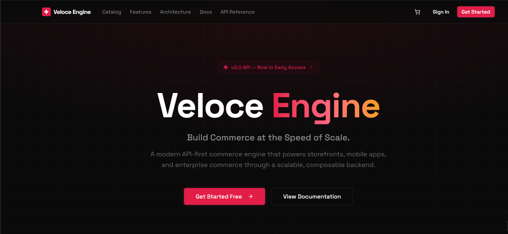
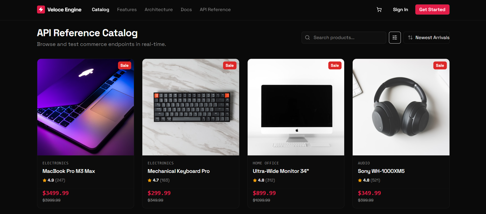
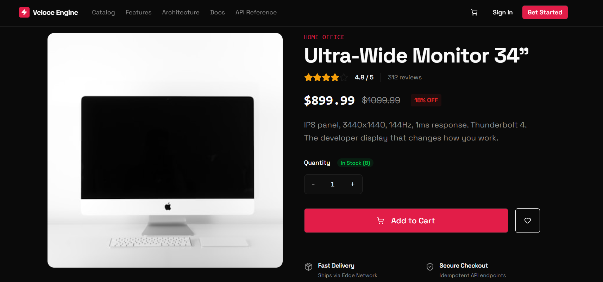
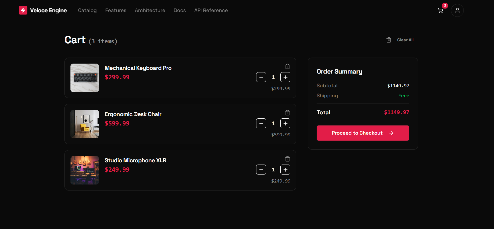

# VeloceEngine

<div align="center">

### API-First Headless E-Commerce Engine

Build Commerce Without Limits.

A modern, production-grade headless commerce platform built using an API-first architecture. VeloceEngine decouples the commerce backend from the frontend, enabling multiple clients—including web applications, admin dashboards, mobile apps, and third-party integrations—to consume the same REST APIs.

[](https://nextjs.org/)
[](https://react.dev/)
[](https://www.typescriptlang.org/)
[](https://expressjs.com/)
[](https://www.mongodb.com/)
[](https://nodejs.org/)

</div>

---

## Table of Contents

- [About](#about)
- [Key Features](#key-features)
- [Tech Stack](#tech-stack)
- [Architecture](#architecture)
- [Folder Structure](#folder-structure)
- [Application Overview](#application-overview)

---

# About

VeloceEngine is a **production-grade Headless E-Commerce Engine** designed with an **API-first** philosophy.

Unlike traditional e-commerce platforms where the frontend and backend are tightly coupled, VeloceEngine separates the commerce engine from the presentation layer. This architecture enables different clients—including customer storefronts, admin dashboards, mobile applications, and external services—to interact with the same backend through standardized REST APIs.

The project emphasizes scalable backend architecture, secure authentication, modular code organization, and modern frontend development practices while following production-ready software engineering principles.

---

# Key Features

## Authentication & Authorization

- JWT-based authentication
- Password hashing using bcrypt
- Role-Based Access Control (RBAC)
- Protected API routes
- Secure cookie-based authentication

---

## Customer Experience

- Modern responsive storefront
- Product browsing
- Product details page
- Category filtering
- Shopping cart
- Wishlist management
- User profile
- Order history
- Product reviews

---

## Admin Dashboard

- Dashboard overview
- Product management
- Category management
- Order management
- User management
- Analytics dashboard
- Inventory management

---

## Backend Features

- RESTful API architecture
- Modular Express.js backend
- MongoDB Atlas database
- Mongoose ODM
- Cloudinary image uploads
- Multer middleware
- Request validation
- Error handling
- Clean project architecture

---

## Frontend Features

- Server-side rendering using Next.js
- Type-safe development with TypeScript
- Responsive UI
- Modern component architecture
- Global state management
- Efficient server-state caching
- Form validation
- Optimized API communication

---

# Tech Stack

## Frontend

| Technology | Purpose |
|------------|---------|
| Next.js | React Framework |
| React | UI Development |
| TypeScript | Type Safety |
| Tailwind CSS | Styling |
| shadcn/ui | UI Components |
| TanStack Query | Server State Management |
| Zustand | Global State Management |
| React Hook Form | Form Handling |
| Zod | Schema Validation |

---

## Backend

| Technology | Purpose |
|------------|---------|
| Node.js | Runtime |
| Express.js | Backend Framework |
| MongoDB Atlas | Database |
| Mongoose | ODM |

---

## Authentication

| Technology | Purpose |
|------------|---------|
| JWT | Authentication |
| bcrypt | Password Hashing |

---

## Media Management

| Technology | Purpose |
|------------|---------|
| Cloudinary | Image Storage |
| Multer | File Uploads |

---

# Architecture

VeloceEngine follows a modern **Headless Commerce Architecture**, where the frontend and backend are completely decoupled.

```text
                     ┌──────────────────────┐
                     │     Customer UI      │
                     │      (Next.js)       │
                     └──────────┬───────────┘
                                │
                                │ REST API
                                │
                     ┌──────────▼───────────┐
                     │   Express Backend    │
                     │  Business Logic/API  │
                     └──────────┬───────────┘
                                │
          ┌─────────────────────┼──────────────────────┐
          │                     │                      │
          ▼                     ▼                      ▼
   MongoDB Atlas         Cloudinary             Authentication
     Database          Media Storage            JWT + bcrypt
```

### Design Principles

- API-first architecture
- Headless commerce design
- Modular backend structure
- Separation of concerns
- Scalable REST APIs
- Secure authentication
- Reusable frontend components

---

# Folder Structure

```text
VeloceEngine
│
├── frontend/
│   ├── app/
│   ├── components/
│   ├── hooks/
│   ├── lib/
│   ├── store/
│   ├── services/
│   └── types/
│
├── backend/
│   ├── controllers/
│   ├── middleware/
│   ├── models/
│   ├── routes/
│   ├── services/
│   ├── utils/
│   ├── config/
│   └── server.js
│
├── shared/
│
├── docs/
│   ├── images/
│   └── api/
│
└── README.md
```

---

# Application Overview

The platform consists of two primary applications.

## Customer Application

The customer storefront enables users to browse products, manage their cart and wishlist, place orders, review purchased products, and manage their account through a responsive modern interface.

---

## Admin Application

The admin dashboard provides centralized management for products, categories, users, and orders while offering insights into platform activity through analytics and management tools.

---

> **Note:** VeloceEngine is actively being developed. Additional features and architectural improvements will be introduced in future releases.

---

# Screenshots

> Screenshots will be added after the first stable release.

## Landing Page



---

## Product Listing



---

## Product Details



---

## Shopping Cart



---

# Demo

The project demo will be available after deployment.


# Known Limitations

The following features are currently under development:

- Online payments
- Email notifications
- Advanced analytics
- Docker support
- Automated testing
- API documentation

---

# Frequently Asked Questions

### Why Headless Commerce?

A headless architecture separates the backend commerce engine from the frontend, allowing multiple clients to consume the same APIs.

---

### Why Next.js?

Next.js provides server-side rendering, routing, performance optimizations, and an excellent developer experience.

---

### Why MongoDB?

MongoDB offers flexible document-based storage that works well with scalable e-commerce applications.

---

# License

This project is licensed under the MIT License.

See the LICENSE file for additional details.

---

# Author

**Ishika Bansal**

Full Stack Developer

GitHub:
```
https://github.com/ishikaa24
```


---

# Support

If you found this project helpful, consider giving it a ⭐ on GitHub.

Your support helps improve the project and encourages future development.

---

# Acknowledgements

This project was inspired by modern software engineering principles and the architecture used in contemporary headless commerce platforms.

Special thanks to the open-source community and the creators of:

- Next.js
- React
- Express.js
- MongoDB
- Tailwind CSS
- shadcn/ui
- TanStack Query
- Zustand
- Cloudinary

---

# Future Vision

VeloceEngine aims to evolve into a production-ready, extensible commerce engine with features such as:

- Microservice-ready architecture
- Multi-vendor marketplace support
- Multi-language support
- Multi-currency support
- AI-powered product recommendations
- Event-driven architecture
- Advanced analytics
- Enterprise-grade security
- Scalable cloud deployment

---

<div align="center">

## VeloceEngine

### Build Commerce Without Limits.

Built with ❤️ using Next.js, Express.js, MongoDB, and TypeScript.

If you like this project, don't forget to ⭐ the repository.

</div>